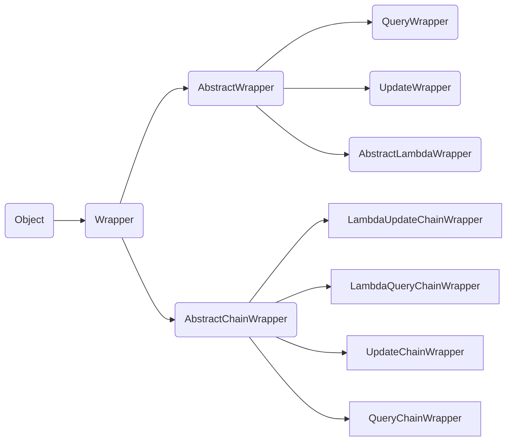

# Mybatis-Plus详解

## 一、简介

**1、Mybatis-Plus介绍**

MyBatis-Plus（简称 MP）是一个 MyBatis 的增强工具，在 MyBatis 的基础上只做增强不做改变，为简化开发、提高效率而生。

官网：[https://mybatis.plus/](https://mybatis.plus/) 或 [https://mp.baomidou.com/](https://baomidou.com/)

**2、代码以及文档**

文档地址：[mybatis.plus](mybatis.plus)

源码地址：[https://github.com/baomidou/mybatis-plus](https://github.com/baomidou/mybatis-plus)

**3、特性**

- **无侵入**：只做增强不做改变，引入它不会对现有工程产生影响，如丝般顺滑
- **损耗小**：启动即会自动注入基本 CURD，性能基本无损耗，直接面向对象操作
- **强大的 CRUD 操作**：内置通用 Mapper、通用 Service，仅仅通过少量配置即可实现单表大部分 CRUD 操作，更有强大的条件构造器，满足各类使用需求
- **支持 Lambda 形式调用**：通过 Lambda 表达式，方便的编写各类查询条件，无需再担心字段写错
- **支持主键自动生成**：支持多达 4 种主键策略（内含分布式唯一 ID 生成器 - Sequence），可自由配置，完美解决主键问题
- **支持 ActiveRecord 模式**：支持 ActiveRecord 形式调用，实体类只需继承 Model 类即可进行强大的 CRUD 操作
- **支持自定义全局通用操作**：支持全局通用方法注入（ Write once, use anywhere ）
- **内置代码生成器**：采用代码或者 Maven 插件可快速生成 Mapper 、 Model 、 Service 、 Controller 层代码，支持模板引擎，更有超多自定义配置等您来使用
- **内置分页插件**：基于 MyBatis 物理分页，开发者无需关心具体操作，配置好插件之后，写分页等同于普通 List 查询
- **分页插件支持多种数据库**：支持 MySQL、MariaDB、Oracle、DB2、H2、HSQL、SQLite、Postgre、SQLServer 等多种数据库
- **内置性能分析插件**：可输出 Sql 语句以及其执行时间，建议开发测试时启用该功能，能快速揪出慢查询
- **内置全局拦截插件**：提供全表 delete 、 update 操作智能分析阻断，也可自定义拦截规则，预防误操作

4、框架结构


## 二、通用CRUD

以下的CRUD操作都必须要掌握

### （一）插入操作

```java
/**
* 插入一条记录 
*
* @param entity 实体对象 
*/ 
int insert(T entity); 

@Test
public void testInsert() {
    System.out.println(("----- selectAll method test ------"));
    User user = new User();
    user.setName=("shuishui");
    user.setAge(3);
    user.setEmail("12434141@qq.com");

    userMapper.insert(user);
}
//数据库插入的id为全局默认的id（ID_WORKER)
```

**主键生成策略**

- 主键自增

  - 需要配置主键自增

    实体类字段上` @TableId（type =IdType.AUTO`

    数据库字段一定要是自增的
    ```java
    //源码详解
    public enum IdType {
        AUTO(0),   //数据可id自增
        NONE(1),   //未设置主键
        INPUT(2),   //手动输入
        ID_WORKER(3), //默认的全局唯一id
        UUID(4),  //全局唯一id uuid
        ID_WORKER_STR(5); // ID_WORKEK 字符串表示法
    
        private int key;
    
        private IdType(int key) {
            this.key = key;
        }
    
        public int getKey() {
            return this.key;
        }
    }
    ```

    

- 分布式系统唯一id生成

- 雪花算法

  - SnowFlake 算法，是 Twitter 开源的分布式 id 生成算法。
  - 其核心思想就是：使用一个 64 bit 的 long 型的数字作为全局唯一 id。在分布式系统中的应用十分广泛，且ID 引入了时间戳，基本上保持自增的。
  - 这 64 个 bit 中，其中 1 个 bit 是不用的，然后用其中的 41 bit 作为毫秒数，用 10 bit 作为工作机器 id，12 bit 作为序列号。

### （二）更新操作

```java
/**
* 根据 ID 修改 
*
* @param entity 实体对象 
*/ 
int updateById(@Param(Constants.ENTITY) T entity); 
/**
* 根据 whereEntity 条件，更新记录
*
* @param entity 实体对象 (set 条件值,可为 null) 
* @param updateWrapper 实体对象封装操作类（可以为 null,里面的 entity 用于生成 where 语句） 
*/ 
int update(@Param(Constants.ENTITY) T entity, @Param(Constants.WRAPPER) Wrapper<T> updateWrapper);


@Test
public void testUpdate() {
    //sql自动动态配置
    User user = new User();
    user.setName=("shui");
    user.setId(3L);
    user.setAge("18");

    //注意：updateById的参数是一个对象
    userMapper.updateById(user);
}
```

**自动填充**

创建时间、修改时间的操作都是自动化完成，不希望手动更新

1. 数据库级别

    在表中新增字段 create_time 、update_time(默认CURRENT_TIMESIAMP)

2. 代码级别

    实体类上的属性需要增加注解 `@TableField`

   ```java
   //创建时间
   @TableField(fill = FieldFill.INSERT)
   private Date createTime;
   
   //更新时间 
   @TableField(fill = FieldFill.INSERT_UPDATE)
   private Date updateTime;
   ```

   代码实现（编译器会自动处理上面的注解）

   ```java
   @Slf4j
   @Component
   public class MyMetaObjectHandler implements MetaObjectHandler {
   
       //插入时候的填充策略
       @Override
       @Componcent  //一定不要忘记吧处理器加到IOC容器中
       public void insertFill(MetaObject metaObject) {
           log.info("start insert fill ....");  //日志
           //设置字段的值（String fieldName字段名,Object fieldVal要传递的值,MetaObject metaObject)
           this.setFieldValByName("createTime",new Date(),metaObject);
           this.setFieldValByName("updateTime", new Date(), metaObject);
           
           //this.strictInsertFill(metaObject, "createTime", LocalDateTime.class, LocalDateTime.now()); // 起始版本 3.3.0(推荐使用)
          // this.fillStrategy(metaObject, "createTime", LocalDateTime.now()); // 也可以使用(3.3.0 该方法有bug请升级到之后的版本如`3.3.1.8-SNAPSHOT`)
           /* 上面选其一使用,下面的已过时(注意 strictInsertFill 有多个方法,详细查看源码) */
           //this.setFieldValByName("operator", "Jerry", metaObject);
           //this.setInsertFieldValByName("operator", "Jerry", metaObject);
       }
   
       //更新时间的填充策略
       @Override
       public void updateFill(MetaObject metaObject) {
           log.info("start update fill ....");
           this.setFieldValByName("updateTime", new Date(), metaObject);
           
           //this.strictUpdateFill(metaObject, "updateTime", LocalDateTime.class, LocalDateTime.now()); // 起始版本 3.3.0(推荐使用)
          // this.fillStrategy(metaObject, "updateTime", LocalDateTime.now()); // 也可以使用(3.3.0 该方法有bug请升级到之后的版本如`3.3.1.8-SNAPSHOT`)
           /* 上面选其一使用,下面的已过时(注意 strictUpdateFill 有多个方法,详细查看源码) */
           //this.setFieldValByName("operator", "Tom", metaObject);
           //this.setUpdateFieldValByName("operator", "Tom", metaObject);
       }
   }
   ```


### （三）删除操作

```java
/**
* 根据 ID 删除 
*
* @param id 主键ID 
*/ 
int deleteById(Serializable id);

/**
* 根据 entity 条件，删除记录
*
* @param wrapper 实体对象封装操作类（可以为 null）
*/ 
int delete(@Param(Constants.WRAPPER) Wrapper<T> wrapper);

/**
* 删除（根据ID 批量删除）
*
* @param idList 主键ID列表(不能为 null 以及 empty)
*/ 
int deleteBatchIds(@Param(Constants.COLLECTION) Collection<? extends Serializable> idList);

/**
* 根据 columnMap 条件，删除记录
*
* @param columnMap 表字段 map 对象 
*/ 
int deleteByMap(@Param(Constants.COLUMN_MAP) Map<String, Object> columnMap);
```

测试实例：

```java
@Test
public void testDeleteById(){
    userMapper.deleteById(1);
}

//批量删除
@Test
public void testDeleteBatchId(){
    userMapper.deleteBatchIds(Arrays.asList(1,2));
}

//条件删除
@Test
public void testDeleteMap(){
    HashMap<String,Object> map = new HashMap<>();
    map.put("name","shuishui");
    userMapper.deleteByMap(Map);
}
```

**逻辑删除**

> 物理删除 ：从数据库中直接移出
>
> 逻辑删除：在数据库中没有被移出，而是通过一个变量来让他失效！deleted=0 ==>deleted =1(失效)

只对自动注入的 sql 起效:

- 插入: 不作限制
- 查找: 追加 where 条件过滤掉已删除数据,如果使用 wrapper.entity 生成的 where 条件也会自动追加该字段
- 更新: 追加 where 条件防止更新到已删除数据,如果使用 wrapper.entity 生成的 where 条件也会自动追加该字段
- 删除: 转变为更新

1. application.yml 加入配置(如果项目默认值和mp默认的一样,该配置可无)

```yml
mybatis-plus:
  global-config:
    db-config:
      logic-delete-field: flag  #全局逻辑删除字段值 3.3.0开始支持
      logic-delete-value: 1 # 逻辑已删除值(默认为 1)
      logic-not-delete-value: 0 # 逻辑未删除值(默认为 0)
```

2. 注册 Bean(3.1.1开始不再需要这一步)

```java
@Configuration
public class MyBatisPlusConfiguration {
    @Bean
    public ISqlInjector sqlInjector() {
        return new LogicSqlInjector();
    }
}
```

3. 实体类字段上加上`@TableLogic`注解

```java
@TableLogic
private Integer deleted;
```

- 效果: 使用mp自带方法删除和查找都会附带逻辑删除功能 (自己写的xml不会)

- 全局逻辑删除: 3.3.0开始支持

  - 如果公司代码比较规范，比如统一了全局都是flag为逻辑删除字段。

  - 使用此配置则不需要在实体类上添加 @TableLogic。

  - 但如果实体类上有 @TableLogic 则以实体上的为准，忽略全局。 即先查找注解再查找全局，都没有则此表没有逻辑删除。

    ```yml
    mybatis-plus:
      global-config:
        db-config:
          logic-delete-field: flag  #全局逻辑删除字段值
    ```

说明

- 逻辑删除是为了方便数据恢复和保护数据本身价值等等的一种方案，但实际就是删除。
- 若需要再查出来，或者需要频繁查出来看就不应使用逻辑删除，而是以一个状态去表示。如： 员工离职，账号被锁定等都应该是一个状态字段，此种场景不应使用逻辑删除。
- 若确需查找删除数据，如老板需要查看历史所有数据的统计汇总信息，请单独手写sql。

### （四）查询操作

```java
/**
* 根据 ID 查询 
*
* @param id 主键ID 
*/ 
T selectById(Serializable id); 

/**
* 根据 entity 条件，查询一条记录
*
* @param queryWrapper 实体对象封装操作类（可以为 null）
*/ 
T selectOne(@Param(Constants.WRAPPER) Wrapper<T> queryWrapper);


/**
* 查询（根据ID 批量查询）
*
* @param idList 主键ID列表(不能为 null 以及 empty)
*/ 
List<T> selectBatchIds(@Param(Constants.COLLECTION) Collection<? extends Serializable> idList);

/**
* 根据 entity 条件，查询全部记录
*
* @param queryWrapper 实体对象封装操作类（可以为 null）
*/ 
List<T> selectList(@Param(Constants.WRAPPER) Wrapper<T> queryWrapper);

/**
* 查询（根据 columnMap 条件）
*
* @param columnMap 表字段 map 对象
*/ 
List<T> selectByMap(@Param(Constants.COLUMN_MAP) Map<String, Object> columnMap);

/**
* 根据 Wrapper 条件，查询全部记录
*
* @param queryWrapper 实体对象封装操作类（可以为 null）
*/ 
List<Map<String, Object>> selectMaps(@Param(Constants.WRAPPER) Wrapper<T> queryWrapper);

/**
* 根据 Wrapper 条件，查询全部记录。注意： 只返回第一个字段的值
*
* @param queryWrapper 实体对象封装操作类（可以为 null）
*/ 
List<Object> selectObjs(@Param(Constants.WRAPPER) Wrapper<T> queryWrapper);


/**
* 根据 entity 条件，查询全部记录（并翻页）
*
* @param queryWrapper 实体对象封装操作类（可以为 null）
*/ 
IPage<T> selectPage(IPage<T> page, @Param(Constants.WRAPPER) Wrapper<T> queryWrapper);

/**
* 根据 Wrapper 条件，查询全部记录（并翻页）
*
* @param page 分页查询条件（可以为 RowBounds.DEFAULT）
* @param queryWrapper 实体对象封装操作类（可以为 null）
*/ 
IPage<Map<String, Object>> selectMapsPage(IPage<T> page, @Param(Constants.WRAPPER) Wrapper<T> queryWrapper);

/**
* 根据 Wrapper 条件，查询总记录数
*
* @param queryWrapper 实体对象封装操作类（可以为 null）
*/ 
Integer selectCount(@Param(Constants.WRAPPER) Wrapper<T> queryWrapper);

```

测试实例

```java
@Test
public void testSelectById(){
    User user =userMapper.selectById(1);
    System.out.println(user)
}

//测试批量查询
@Test
public void testSelectByBatchId(){
    List<User> user =userMapper.selectBatchIds(Arrays.asList(1,2,3));
    users.forEach(System.out::println)
}

//条件查询
public void testSelectByBatchIds(){
    HashMap<String,Object> map=new HashMap<>();
    //自定义查询
    map.put("name","shuishui");
    map.put("age",3);
    
    List<User> user = userMapper.selectByMap(map);
    users.forEach(System.out::println);
}

//查询指定字段
QueryWrapper<CasesFeedback> queryWrapper = new QueryWrapper<>();
queryWrapper.select(CasesFeedback.class,info ->
                    !info.getColumn().equals("create_time")&&
                    !info.getColumn().equals("update_time") &&
                    !info.getColumn().equals("deleted")&&
                    !info.getColumn().equals("id"));

```

**自定义sql**

- 方法一：在Mapper文件中定义一个方法

  ```java
  @Select("select * from user #{ew.customSqlSegment}")
  List<User> selectAll(@Param(Constants.WRAPPER) Wrapper<User> wrapper);
  ```

- 方式二：将sql写入xml中

  在application中加入扫描mapper文件路径

  ```yaml
  mybatis-plus:
  	mapper-locations: com/mp/mapper/*
  ```

  在Mapper.xml 中写sql

  ```xml
  <mapper namespace="com.mp.dao.UserMapper">
  	<select id="selectAll" resultType="com.mp.entity.User">
      	select * from user #{ew.customSqlSegment}
      </select>
  </mapper>
  ```


## 三、配置

一部分是Mybatis原生的配置，另一部分是MP的配置，但大都为 MyBatis 原生支持的配置，可以通过 MyBatis XML 配置文件的形式进行配置。

**1、基本配置**

**configLocation**

MyBatis 配置文件位置，如果您有单独的 MyBatis 配置，请将其路径配置到 configLocation 中。 

MyBatis Configuration 的具体内容请参考MyBatis 官方文档。

**mapperLocations**

MyBatis Mapper 所对应的 XML 文件位置，如果您在 Mapper 中有自定义方法（XML 中有自定义实现），需要进行该配置，告诉 Mapper 所对应的 XML 文件位置。

**typeAliasesPackage**

MyBaits 别名包扫描路径，通过该属性可以给包中的类注册别名，注册后在 Mapper 对应的 XML 文件中可以直接使用类名，而不用使用全限定的类名（即 XML 中调用的时候不用包含包名）。

**2、进阶配置**

**mapUnderscoreToCamelCase**

- 类型： boolean
- 默认值： true

是否开启自动驼峰命名规则（camel case）映射，即从经典数据库列名 A_COLUMN（下划线命名）到经典 Java 属性名 aColumn（驼峰命名）的类似映射。

**cacheEnabled**

- 类型： boolean
- 默认值： true

全局地开启或关闭配置文件中的所有映射器已经配置的任何缓存，默认为 true。

示例：

```text
mybatis-plus.configuration.cache-enabled=false
```

**3、DB 策略配置**

**idType**

- 类型： com.baomidou.mybatisplus.annotation.IdType
- 默认值： ID_WORKER

全局默认主键类型，设置后，即可省略实体对象中的@TableId(type = IdType.AUTO)配置

**tablePrefifix**

- 类型： String
- 默认值： null

表名前缀，全局配置后可省略 @TableName() 配置。

如果数据库中所有表都有个表名前缀，比如我们想让  **t_user_info**  表仍然对应  **UserInfo**  实体类，可以添加如下全局配置设置表名前缀：

```properties
mybatis-plus.global-config.db-config.table-prefix=t_
```

## 四、条件构造器

在 MP 的 Wrapper 接口的实现类关系里， AbstractWrapper 和 AbstractChainWrapper 是重点实现，应该重点学习 AbstractWrapper 以及其子类



说明：

QueryWrapper(LambdaQueryWrapper) 和 UpdateWrapper(LambdaUpdateWrapper) 的父类 用于生成 sql 的 where 条件, entity 属性也用于生成 sql 的 where 条件 

注意: entity 生成的 where 条件与 使用各个 api 生成的 where 条件**没有任何关联行为** 。

**测试实例**

```java
@Test
void contextLoads(){
    // 查询name不为null，并且邮箱不为null，年龄大于等于20的用户
    QueryWrapper<User> wrapper =new QueryWrapper<>();
    wrapper.isNotNull("name");
    wrapper.isNotNull("email");
    wrapper.ge("age",12);
    userMapper.selectList(wrapper).forEach(System.out::println);
}

@Test
void test2(){
    // 查询name为shuishui的用户
    QueryWrapper<User> wrapper =new QueryWrapper<>();
    wrapper.eq("name","shuishui");
    User user=userMapper.selectList(wrapper)
    System.out.println（user）;
}

@Test
void test3(){
    // 查询年龄在20~30岁之间的用户
    QueryWrapper<User> wrapper =new QueryWrapper<>();
    wrapper.between("age",20,30);
    Integer count =userMapper.selectCount(wrapper);//查询结果数
    System.out.println（count）;
}

//模糊查询
@Test
void test4(){
    QueryWrapper<User> wrapper =new QueryWrapper<>();
    
    wrapper.notLike("name",“s”);//相当于NOT LIKE '%s%'
    wrapper.likeRight("email",“s”);//相当于LIKE 's%'
    List<Map<String,Object>>maps =userMapper.selectMaps(wrapper);//查询结果数
    maps.forEach(System.out::println);
}


@Test
void test5(){
    QueryWrapper<User> wrapper =new QueryWrapper<>();
    //子查询
    wrapper.insql("id","select id from user where id<3");
    List<Object> objects =userMapper.selectobjs(wrapper);
    objects.forEach(System.out::println);
}
    
@Test
void test6(){
    QueryWrapper<User> wrapper =new QueryWrapper<>();
    //通过id进行排序
    wrapper.orderByAsc("id");
    List<User> users =userMapper.selectList(wrapper);
    objects.forEach(System.out::println);
}

//姓王年龄大于等于25，按年龄降序，年龄相同按id升序排列
void test7(){
    QueryWrapper<User> wrapper =new QueryWrapper<>();
   	wrapper
        .likeRoght("name","王")
        .or()
        .ge("age",25)
        .ordeiByDesc("age")
        .orderByAsc("id");
    List<User> users =userMapper.selectList(wrapper);
    objects.forEach(System.out::println);
}

//创建日期为2019年2月14日并且直属上级为姓王
void test8(){
    QueryWrapper<User> wrapper =new QueryWrapper<>();
    wrapper
        .apply("date_fromat(create_time,'%Y-%m-%d')='2019-02-14'")
        .inSql("manager_id","select id from user where name like '王%'");
    List<User> users =userMapper.selectList(wrapper);
    objects.forEach(System.out::println);
}

//姓王并且（年龄小于40或者邮箱不为空）
void test9(){
    QueryWrapper<User> wrapper = new QueryWrapper<>();
    //lt小于，gt大于
    wrapper
        .likeRoght("name","王")
        .and(wq->wa.lt("age",40)
        .or().
             isNotNull("email"))
    List<User> users =userMapper.selectList(wrapper);
    objects.forEach(System.out::println);
}

//不列出所有字段
@Test
void test10(){
    QueryWrapper<User> wrapper =new QueryWrapper<>();
    
    wrapper.select("id","name").like("name","雨").lt("age",40);
    //不显示时间和id
    //wrapper.select(User.class,info->!info.getColumn().equals("create_time")&&!info.getColumn().equals("manager_id")).like("name","雨").lt("age",40);
    List<User> users =userMapper.selectList(wrapper);
    objects.forEach(System.out::println);
}
```

**alleq的用法**

示例

```java
/**
* 全部eq(或个别isNull)
*
* @param params key为数据库字段名,value为字段值
* @param null2IsNull 为 true 则在 map 的 value 为 null 时调用 isNull 方法,为false时当 value为 null 则直接忽略 
*/ 
allEq(Map<R, V> params)
allEq(Map<R, V> params, boolean null2IsNull)
allEq(boolean condition, Map<R, V> params, boolean null2IsNull)
    
allEq(BiPredicate<R, V> filter, Map<R, V> params)
allEq(BiPredicate<R, V> filter, Map<R, V> params, boolean null2IsNull)
allEq(boolean condition, BiPredicate<R, V> filter, Map<R, V> params, boolean null2IsNull) 
```

- `allEq({id:1,name:"老王",age:null})`—>id = 1 and name = '老王' and age is null
- `allEq({id:1,name:"老王",age:null}, false)`—>id = 1 and name = '老王'
- `allEq((k,v) -> k.contains("a"), {id:1,name:"老王",age:null})`--->name = '老王' and age is null
- `allEq((k,v) -> k.contains("a"), {id:1,name:"老王",age:null}, false)`--->name = '老王'

测试实例

```java
@Test
void selecrAlleq(){
    QueryWrapper<User> wrapper =new QueryWrapper<>();
    Map<String,Object> params=new HashMap<String,Object>();
    params.put("name","水");
    params.put("age",25);
    wrapper.allEq(params);
   
    List<User> users = userMapper.selectList(wrapper);
    users.forEach(System.out::println);
}
```

**condition用法**

```java
public void testCondition() {
    String name ="王";
    String email = "";
    condition(name,email);
}
private void condition(String name, String email) {
    QueryWrapper<User> queryWrapper = new QueryWrapper<User>();
    // if(StringUtils.isNotEmpty(name)){
    //     queryWrapper.like("name", name);
    // }
    // if(StringUtils.isNotEmpty(email)){
    //     queryWrapper.like("email", email);
    // }
    queryWrapper.like(StringUtils.isNotEmpty(name),"name", name)
        .like(StringUtils.isNotEmpty(email), "email", email);
    
	List<User> userList = userMapper.selectList(queryWrapper);
    userList.forEach(System.out.:println);
}
```


**Lambda 条件构造器**

作用：防误写

```java
@Test
public void selectLambda(){
    // LambdaQueryWrapper<User> lambda =new QueryWrapper<User>().lambda();
    // LambdaQueryWrapper<User> lambda =new LambdaQueryWrapper<User>();
    LambdaQueryWrapper<User> lambda =new Wrapper.<User>lambdaQuery();
    lambda.like(User::getName,"雨").lt(User::getAge,40);   //写错会直接爆红
    List<user> userList =userMapper.selectList(lambdaQuery);
    userList.forEach(System.out::println);
}
```

更多内容详见文档：[https://baomidou.com/pages/10c804/](https://baomidou.com/pages/10c804/)

## 五、快速开始

**1、编写代码，快速集成**

Mybatis整合MP的用法：Mybatis+MP、Spring+Mybatis+MP、Spring Boot+Mybatis+MP

创建数据库以及表

```sql
DROP TABLE IF EXISTS user;
CREATE TABLE user
(
	id BIGINT(20) NOT NULL COMMENT '主键ID',
	name VARCHAR(30) NULL DEFAULT NULL COMMENT '姓名',
	age INT(11) NULL DEFAULT NULL COMMENT '年龄',
	email VARCHAR(50) NULL DEFAULT NULL COMMENT '邮箱',
	PRIMARY KEY (id)
);

DELETE FROM user;
INSERT INTO user (id, name, age, email) VALUES
(1, 'Jone', 18, 'test1@baomidou.com'),
(2, 'Jack', 20, 'test2@baomidou.com'),
(3, 'Tom', 28, 'test3@baomidou.com'),
(4, 'Sandy', 21, 'test4@baomidou.com'),
(5, 'Billie', 24, 'test5@baomidou.com');
```

创建工程、导入依赖

```xml
<!-- mybatis-plus插件依赖 --> 
<dependency> 
    <groupId>com.baomidou</groupId> 
    <artifactId>mybatis-plus</artifactId> 
    <version>3.1.1</version> 
</dependency> 
<!-- MySql --> 
<dependency> 
    <groupId>mysql</groupId> 
    <artifactId>mysql-connector-java</artifactId> 
    <version>5.1.47</version> 
</dependency> 
<!--简化bean代码的工具包--> 
<dependency> 
    <groupId>org.projectlombok</groupId> 
    <artifactId>lombok</artifactId> 
    <optional>true</optional> 
    <version>1.18.4</version> 
</dependency> 
```

配置文件application.yml

```yml
spring:
  #配置数据源
  datasource:
    driver-class-name: com.mysql.cj.jdbc.Driver
    url: jdbc:mysql://localhost:3306/mybatis_plus?useSSL=false&serverTimezone=GMT%2B8&useUnicode=true&characterEncoding=utf-8
    username: root
    password: 123456

#配置日志，需要查看日志才能显示sql
mybatis-plus:
  configuration:
    log-impl: org.apache.ibatis.logging.stdout.StdOutImpl
```

mybatis-plus的使用步骤：引入依赖 -> 创建pojo -> 实现dao接口（不用写mapper.xml文件，只需要在启动器上配置 mapper 扫描路径即可）-> 基本使用

编写实体类 `User.java`

```java
@Data
@AllArgsConstructor
@NoArgsConstructor
public class User {
    private Long id;
    private String name;
    private Integer age;
    private String email;
}
```

编写Mapper类 `UserMapper.java`

```java
//在对应的Mapper上继承基本的类baseMapper
public interface UserMapper extends BaseMapper<User> {
    //所有的CRUD已经编写完成,不需要像以前的配置一些xml
}
```

在 Spring Boot 启动类中添加 `@MapperScan` 注解，扫描 Mapper 文件夹

```java
@SpringBootApplication
@MapperScan("com.baomidou.mybatisplus.mapper")//扫描mapper文件夹
public class Application {
    public static void main(String[] args) {
        SpringApplication.run(QuickStartApplication.class, args);
    }
}
```

编写测试类，进行功能测试

```java
@RunWith(SpringRunner.class)
@SpringBootTest
public class SampleTest {

    @Autowired
    private UserMapper userMapper;

    @Test
    public void testSelect() {
        System.out.println(("----- selectAll method test ------"));
        // UserMapper 中的 selectList() 方法的参数为 MP 内置的条件封装器 Wrapper，所以不填写就是无任何条件
        //查询所有的用户 
        List<User> userList = userMapper.selectList(null);
        Assert.assertEquals(5, userList.size());
        userList.forEach(System.out::println);
    }

}
```

通过以上几个简单的步骤，我们就实现了 User 表的 CRUD 功能，连 XML 文件都不用编写，可以看到集成`MyBatis-Plus`非常的简单，只需要引入 starter 工程，并配置 mapper 扫描路径即可。

**2、配置日志**

```properties
#配置日志
mybatis-plus.configuration.logimpl=org.apache.ibatis.logging.stdout.StdOutImpl
```

```java
@Data
@AllArgsConstructor
@NoArgsConstructor
public class User {
    // 对应数据库中的主键 (uuid、自id、雪花算法、redis、zookeeper ! )
    @TableId(type = IdType.AUTO)
    private Long id;
    private String name;
    private Integer age;
    private String email;
}
```

**3、常用注解**

`@TableName("表名")`：当表名与实体类名不一致时，可以在实体类上加入@TableName（）声明

`@TableId`：声明属性为表中的主键（若属性名称不为默认id）

`@TableFieId("字段")` ：当实体类属性与表字段不一致时，可以用来声明

## 六、通用service

1. 创建一个service接口

```java
public interface UserService extends IService<User>{
    
}
```

2. 创建一个实现类

```java
public class UserServiceImpl extend ServiceImpl<UserMapper,User> implements UserService{
    
}
```

3. 测试

```java
@RunWith(SpringRunner.class)
@SpringBootTest
public class ServiceTest{
    
    @Autowired
    private UserService userService;
    
    //取一个值
    @Test
    public void getOne(){
        User one = userService.getOne(
            Wrapper.<User>lambdaQuery().gt(User::getAge,25),
            false
        );
        
    }
    
    //批量插入
    @Test 
    public void batch(){
        User user1= new User();
        user1.steName("shui");
        user1.setAge("28");
        
        User user2= new User();
        user1.steName("shui2");
        user1.setAge("29");
        List<User> userList =Arrays.asList(user1,user2);
        userService.saveBatch(userList);
    }
    
    @Test 
    public void chain(){
     //查询
     userService.lambdaQuery().ge(User::getAge,25)
         .like(User::getName,"雨").list();
    }
}
```

### AR模式

通过实体类对象直接实现CRUD

**实体类**

```java
@Data
@EqualsAndHashCode(callSuper = false)
public class User extends Model<User> {

    private static final long serialVersionUID = 1L;

    @ApiModelProperty(value = "用户id")
    private String userId;
}
```

**dao层Mapper接口**

```java
public interface UserMapper extends BaseMapper<RentDetail> {

}
```

**测试实例**

```java
// 测试插入
//不用再调用mapper接口，直接实现
@Test
public void insert(){
    User user =new User();
    user.setName("水");
    user.setAge(29);
    ...
    user.insert();  
}

// 测试查询
@Test
public void select(){
    User user =new User();
    user.selectById(1);
}
@Test
public void select2(){
    User user =new User();
    user.setId(1);
    user.selectById();
}

//测试更新
@Test
public void update(){
    User user =new User();
    user.setId(1);
    user.setName("火")
    user.updateById();
}

//测试删除
@Test
public void delete(){
    User user =new User();
    user.setId(1);
    user.deleteById();
}
```


## 八、代码自动生成器

dao、pojo、conrtroller、service自动生成

### （旧） 3.5.1 以下

适用版本：mybatis-plus-generator3.5.1 以下版本版本

```java
import com.baomidou.mybatisplus.annotation.DbType; 
import com.baomidou.mybatisplus.annotation.FieldFill;
import com.baomidou.mybatisplus.annotation.IdType; 
import com.baomidou.mybatisplus.annotation.TableField;
import com.baomidou.mybatisplus.generator.AutoGenerator;
import com.baomidou.mybatisplus.generator.config.DataSourceConfig;
import com.baomidou.mybatisplus.generator.config.GlobalConfig;
import com.baomidou.mybatisplus.generator.config.PackageConfig;
import com.baomidou.mybatisplus.generator.config.StrategyConfig;
import com.baomidou.mybatisplus.generator.config.po.TableFill;
import com.baomidou.mybatisplus.generator.config.rules.DateType; 
import com.baomidou.mybatisplus.generator.config.rules.NamingStrategy;

import java.util.ArrayList;
// 代码自动生成器 
public class CodeGenerator {
     public static void main(String[] args) {       
         // 需要构建一个 代码自动生成器 对象        
         AutoGenerator mpg = new AutoGenerator();   
         // 配置策略
         // 1、全局配置        
         GlobalConfig gc = new GlobalConfig();    
         String projectPath = System.getProperty("user.dir"); 
         gc.setOutputDir(projectPath+"/src/main/java");    
         gc.setAuthor("jobob");     
         gc.setOpen(false);      
         gc.setFileOverride(false);// 是否覆盖      
         gc.setServiceName("%sService");// 去Service的I前缀      
         gc.setIdType(IdType.ID_WORKER);  
         gc.setDateType(DateType.ONLY_DATE);  
         gc.setSwagger2(true);    
         mpg.setGlobalConfig(gc);
         
          //2、设置数据源  
         DataSourceConfig dsc = new DataSourceConfig();  
         dsc.setUrl("jdbc:mysql://localhost:3306/kuang_community? useSSL=false&useUnicode=true&characterEncoding=utf-8&serverTimezone=GMT%2B8");       
         dsc.setDriverName("com.mysql.cj.jdbc.Driver");   
         dsc.setUsername("root");      
         dsc.setPassword("123456");  
         dsc.setDbType(DbType.MYSQL);  
         mpg.setDataSource(dsc);
 
          //3、包的配置     
         PackageConfig pc = new PackageConfig();  
         pc.setModuleName("blog");     
         pc.setParent("com.kuang");    
         pc.setEntity("entity");  
         pc.setMapper("mapper");     
         pc.setService("service");   
         pc.setController("controller");    
         mpg.setPackageInfo(pc);
 
          //4、策略配置      
         StrategyConfig strategy = new StrategyConfig();       
  strategy.setInclude("blog_tags","course","links","sys_settings","user_record"," user_say"); // 设置要映射的表名
         strategy.setNaming(NamingStrategy.underline_to_camel);   
         strategy.setColumnNaming(NamingStrategy.underline_to_camel);   
         strategy.setEntityLombokModel(true);// 自动lombok；
         strategy.setLogicDeleteFieldName("deleted");   // 自动填充配置      
         TableFill gmtCreate = new TableFill("gmt_create", FieldFill.INSERT); 
         TableFill gmtModified = new TableFill("gmt_modified", FieldFill.INSERT_UPDATE);    
         ArrayList<TableFill> tableFills = new ArrayList<>(); 
         tableFills.add(gmtCreate);    
         tableFills.add(gmtModified);     
         strategy.setTableFillList(tableFills);   
         // 乐观锁      
         strategy.setVersionFieldName("version");
         strategy.setRestControllerStyle(true); 
         strategy.setControllerMappingHyphenStyle(true);
         // localhost:8080/hello_id_2     
         mpg.setStrategy(strategy);
         mpg.execute(); 
         //执行   
     } 
}
```

### （新）3.5.1 以上

适用版本：mybatis-plus-generator 3.5.1 及其以上版本，对历史版本不兼容

1. 安装（依赖没有导入这个包，需自行导入）

```xml
<dependency>
    <groupId>com.baomidou</groupId>
    <artifactId>mybatis-plus-generator</artifactId>
    <version>最新版本</version>
</dependency>
```

2. 快速生成

```java
FastAutoGenerator.create("url", "username", "password")
    .globalConfig(builder -> {
        builder.author("baomidou") // 设置作者
            .enableSwagger() // 开启 swagger 模式
            .fileOverride() // 覆盖已生成文件
            .outputDir("D://"); // 指定输出目录
    })
    .dataSourceConfig(builder -> builder.typeConvertHandler((globalConfig, typeRegistry, metaInfo) -> {
        int typeCode = metaInfo.getJdbcType().TYPE_CODE;
        if (typeCode == Types.SMALLINT) {
            // 自定义类型转换
            return DbColumnType.INTEGER;
        }
        return typeRegistry.getColumnType(metaInfo);

    }))
    .packageConfig(builder -> {
        builder.parent("com.baomidou.mybatisplus.samples.generator") // 设置父包名
            .moduleName("system") // 设置父包模块名
            .pathInfo(Collections.singletonMap(OutputFile.xml, "D://")); // 设置mapperXml生成路径
    })
    .strategyConfig(builder -> {
        builder.addInclude("t_simple") // 设置需要生成的表名
            .addTablePrefix("t_", "c_"); // 设置过滤表前缀
    })
    .templateEngine(new FreemarkerTemplateEngine()) // 使用Freemarker引擎模板，默认的是Velocity引擎模板
    .execute();
```

3. 交互式生成

```java
FastAutoGenerator.create(DATA_SOURCE_CONFIG)
    // 全局配置
    .globalConfig((scanner, builder) -> builder.author(scanner.apply("请输入作者名称？")).fileOverride())
    // 包配置
    .packageConfig((scanner, builder) -> builder.parent(scanner.apply("请输入包名？")))
    // 策略配置
    .strategyConfig((scanner, builder) -> builder.addInclude(getTables(scanner.apply("请输入表名，多个英文逗号分隔？所有输入 all")))
                        .controllerBuilder().enableRestStyle().enableHyphenStyle()
                        .entityBuilder().enableLombok().addTableFills(
                                new Column("create_time", FieldFill.INSERT)
                        ).build())
    /*
        模板引擎配置，默认 Velocity 可选模板引擎 Beetl 或 Freemarker
       .templateEngine(new BeetlTemplateEngine())
       .templateEngine(new FreemarkerTemplateEngine())
     */
    .execute();


// 处理 all 情况
protected static List<String> getTables(String tables) {
    return "all".equals(tables) ? Collections.emptyList() : Arrays.asList(tables.split(","));
}
```


## 九、插件

### （一）乐观锁

乐观锁：顾名思义十分乐观，它总是被认为不会出现问题，无论干什么都不去上锁！如果出现了问题，再次更新测试

悲观锁：顾名思义十分悲观，它总是出现问题，无论干什么都会上锁！再去操作！


乐观锁实现方式（当要更新一条记录的时候，希望这条记录没有被别人更新）

- 取出记录是，获取当前version
- 更新事，带上这个version
- 执行更新事，set version=newVersion where version =oldVersion
- 如果version不对，就更新失败

```java
乐观锁： 先查询，获得版本号 version=1
--A
update user set name ="shuishui" ,version =version+1
where id =2 and version=1

--B 如果线程抢先完成，这个时候version=2，会导致A修改失败
update user set name ="shuishui" ,version =version+1
where id =2 and version=1
```

​		

**测试乐观锁**

1. 表中创建乐观锁字段version 默认值为1

2. 同步实体类

   ```java
   @Version //乐观锁Version注解
   private Integer version;
   ```

3. 注册组件 （config包里）

   ```java
   // springboot
   @EnableTransactionManagement
   @MapperScan("com.baomidou.cloud.service.*.mapper*")
   @Configuration//配置类
   public class MyBatisPlusConfig{
       //注册乐观锁插件
        /**
        * 旧版
        */
       @Bean
       public OptimisticLockerInterceptor optimisticLockerInterceptor() {
           return new OptimisticLockerInterceptor();
       }
   
       /**
        * 新版
        */
       @Bean
       public MybatisPlusInterceptor mybatisPlusInterceptor() {
           MybatisPlusInterceptor mybatisPlusInterceptor = new MybatisPlusInterceptor();
           mybatisPlusInterceptor.addInnerInterceptor(new OptimisticLockerInnerInterceptor());
           return mybatisPlusInterceptor;
       }
   }
   
   ```

   ```xml
   <bean class="com.baomidou.mybatisplus.extension.plugins.OptimisticLockerInterceptor"/>
   ```

   特别说明:

   - 支持的数据类型只有: `int,Integer,long,Long,Date,Timestamp,LocalDateTime`
     整数类型下 `newVersion = oldVersion + 1`
   - newVersion 会回写到 entity 中
   - 仅支持 updateById(id) 与 update(entity, wrapper) 方法
   - 在 **update(entity, wrapper) 方法下, wrapper 不能复用**

4. 测试

   在A线程中进行查询操作，B线程也进行查询并且进行更改操作，两个线程并行运行。当A线程进行修改操作时，A线程会覆盖B线程的操作。

### （二）分页查询

1. 原始的limit进行分页

2. pageHelper 第三方插件

3. Mybatis-Plus中也内置了分页插件！

**插件**

1. **Mybatis-Plus分页**

（1）配置拦截器组件即可

```java
//Spring boot方式
@EnableTransactionManagement
@Configuration
@MapperScan("com.baomidou.cloud.service.*.mapper*")
public class MybatisPlusConfig {

    @Bean
    public PaginationInterceptor paginationInterceptor() {
        PaginationInterceptor paginationInterceptor = new PaginationInterceptor();
        // 设置请求的页面大于最大页后操作， true调回到首页，false 继续请求  默认false
        // paginationInterceptor.setOverflow(false);
        // 设置最大单页限制数量，默认 500 条，-1 不受限制
        // paginationInterceptor.setLimit(500);
        // 开启 count 的 join 优化,只针对部分 left join
        paginationInterceptor.setCountSqlParser(new JsqlParserCountOptimize(true));
        return paginationInterceptor;
    }
}
```

（2）测试

```java
//测试分页查询
@Test
pulic void testPage(){
    // 参数一：当前页
    // 参数二：页面大小
    // 使用了分页插件之后，所有的分页操作都变得简单
    Page<User> page =new Page<>(2,5);
    userMapper.selectPage(page,null);
    
    page.getRecords().forEach(System.out::println);
    //获取总数
    page.getTotal();
}
```

2. **自定义的 mapper 使用分页**

mapper

```java
IPage<UserVo> selectPageVo(IPage<?> page, Integer state);
// or (class MyPage extends Ipage<UserVo>{ private Integer state; })
MyPage selectPageVo(MyPage page);
// or
List<UserVo> selectPageVo(IPage<UserVo> page, Integer state);
```

xml

```java
<select id="selectPageVo" resultType="xxx.xxx.xxx.UserVo">
    SELECT id,name FROM user WHERE state=#{state}
</select>
```

注意：

- 如果返回类型是 IPage 则入参的 IPage 不能为null,因为返回的IPage == 入参的IPage; 如果**想临时不分页**,可以在初始化IPage时**size参数传 <0** 的值;
- 如果返回类型是 List 则入参的 IPage 可以为 null(为 null 则不分页),但需要你手动入参的IPage.setRecords(返回的 List);
  如果 xml 需要从 page 里取值,需要 `page.属性` 获取
- 生成 countSql 会在 `left join` 的表不参与 `where` 条件的情况下,把 `left join` 优化掉，建议任何带有 `left join` 的sql,都写标准sql,即给于表一个别名,字段也要 `别名.字段`

3. **Page类**

> 该类继承了 `IPage` 类，实现了 `简单分页模型` 如果你要实现自己的分页模型可以继承 `Page` 类或者实现 `IPage` 类

|         属性名         |  类型   |  默认值   |                             描述                             |
| :--------------------: | :-----: | :-------: | :----------------------------------------------------------: |
|        records         |  List   | emptyList |                         查询数据列表                         |
|         total          |  Long   |     0     |                       查询列表总记录数                       |
|          size          |  Long   |    10     |                   每页显示条数，默认 `10`                    |
|        current         |  Long   |     1     |                            当前页                            |
|         orders         |  List   | emptyList | 排序字段信息，允许前端传入的时候，注意 SQL 注入问题，可以使用 `SqlInjectionUtils.check(...)` 检查文本 |
|    optimizeCountSql    | boolean |   true    | 自动优化 COUNT SQL 如果遇到 `jSqlParser` 无法解析情况，设置该参数为 `false` |
| optimizeJoinOfCountSql | boolean |   true    |         自动优化 COUNT SQL 是否把 join 查询部分移除          |
|      searchCount       | boolean |   true    | 是否进行 count 查询，如果指向查询到列表不要查询总记录数，设置该参数为 `false` |
|        maxLimit        |  Long   |           |                       单页分页条数限制                       |
|        countId         | String  |           | `xml` 自定义 `count` 查询的 `statementId` 也可以不用指定在分页 `statementId` 后面加上 `_mpCount` 例如分页 `selectPageById` 指定 count 的查询 `statementId` 设置为 `selectPageById_mpCount` 即可默认找到该 `SQL` 执行 |

### （三）性能更新插件

作用：性能分析拦截器，用于输出每条SQL语句及执行时间

MP会提供性能分析插件，如果超过这和时间就会停止运行

**参数详解**（不建议生产环境使用）

- maxTime SQL 执行最大时长，超过自动停止运行，有助于发现问题。
- format SQL SQL是否格式化，默认false

**导入插件**

```java
//Spring boot方式
@EnableTransactionManagement
@Configuration
@MapperScan("com.baomidou.cloud.service.*.mapper*")
public class MybatisPlusConfig {

    /**
     * SQL执行效率插件
     */
    // 设置 dev test 环境开启
    // 需要在SpringBoot配置环境为dev或者test环境
    @Bean
    @Profile({"dev","test"})
    public PerformanceInterceptor performanceInterceptor() {
        PerformanceInterceptor performanceInterceptor = new PerformanceInterceptor();
        // ms 设置sql执行的最大时间，如果超过就停止
        performanceInterceptor.setMaxTime(100);
        performanceInterceptor.setFormat(true);
        return new PerformanceInterceptor();
    }
}
```

**测试实例**

```java
@Test
void contextLoads(){
    //参数是一个Wrapper，条件结构器，这里先不用，填null
    //查询全部用户
    List<User> users =userMapper.selectList(null);
    user.forEach(System.out::println);
}
```
